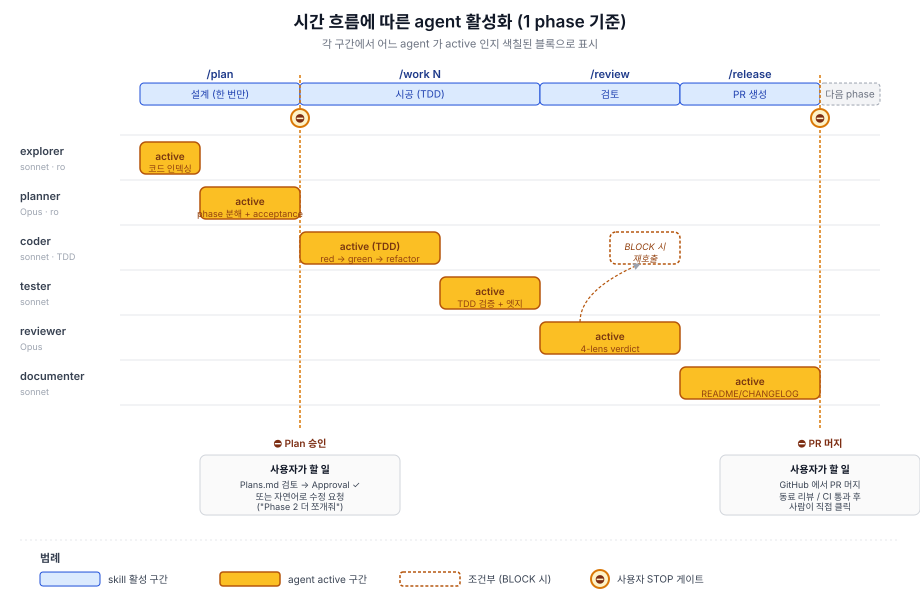
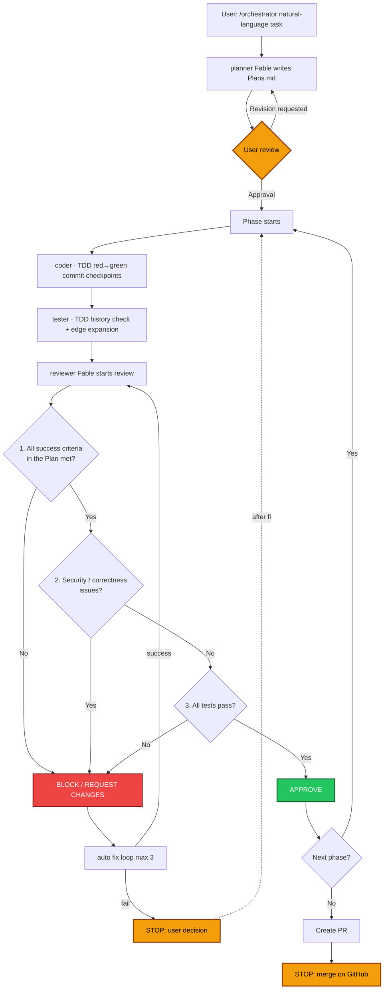

<div align="center">

# claude-code-harness

**A workflow harness for Claude Code v2.1+**

One `/orchestrator` call automates plan → code → review → PR

`6 subagents` · `6 verb skills` · `6 hooks` · `phase runner`

[](https://code.claude.com)
[](LICENSE)

[한국어](README.md) · **English**

</div>

---

## What This Is

> A bundle of procedures that stops the two failure modes Claude Code commonly shows out of the box — **jumping straight into code without a plan** + **running dangerous commands unguarded**.
>
> Activated by copying the `.claude/` tree into your project root.

### Components

| Component | Location | Role |
|---|---|---|
| **Subagents** (6) | `.claude/agents/*.md` | Workers in isolated contexts — `explorer` / `planner` / `coder` / `tester` / `reviewer` / `documenter` |
| **Verb skills** (6) | `.claude/skills/*/SKILL.md` | Slash commands — `/orchestrator` plus 5 optional verbs |
| **PreToolUse hooks** (2) | `.claude/hooks/*.sh` | `block-destructive.sh`, `protect-secrets.sh` |
| **PostToolUse hook** (1) | `.claude/hooks/post-edit-lint.sh` | Auto `ruff format` (or `black`) after Edit/Write — low-nit policy automation |
| **Subagent hook** (1) | `.claude/hooks/announce-agent.sh` | Prints which agent is running to the terminal on SubagentStart/Stop |
| **Loop hooks** (2) | `.claude/hooks/record-verdict.sh`, `enforce-loop.sh` | Record each reviewer verdict in `.claude/notes/loop-state.json` (SubagentStop) → enforce the 3-round auto-fix budget at the end of every turn (Stop) |
| **Phase runner** | `scripts/harness/run_phase.py` | Offloads long phase work |
| **Doc templates** | `docs/harness/*.md` | `REQUIREMENTS` / `ADR` / `DOC_SYNC_POLICY` |

<details>
<summary><strong>Component details</strong></summary>

<br>

**Subagents**
Each runs in its own isolated context window → verbose tool output stays in the sub-session and only a summary returns to the main session. The advisory, decision-heavy stages (`planner`, `reviewer`) run on Fable — the top-tier model; the execution stages (`explorer`, `coder`, `tester`, `documenter`) run on Opus (an advisor + worker split).

**Verb skills**
`/orchestrator` (main) + `/plan`, `/work`, `/review`, `/release`, `/setup` (optional). Natural-language invocation works via description matching. Only `/release` is locked with `disable-model-invocation: true` — it has side effects like commit/push/PR, so the user types it directly.

**Hooks**
Decisions come from stdin JSON → exit code, with no reliance on model prompts. For what each hook blocks / does / how it's tested, see the [Safety + Polish Hooks](#safety--polish-hooks--what-they-do) section below.

**Phase runner**
A `claude --agent <name> -p` wrapper. Spawns long phase work as a separate process → captures stdout to `.claude/notes/phase-N-<agent>-<ts>.log`. Protects main-session context.

**Doc templates**
`REQUIREMENTS.template.md`, `ADR.template.md`, `DOC_SYNC_POLICY.md`.

</details>

---

## Why a Harness

Claude Code is powerful, but its default behavior lacks restraint. Throw a natural-language task at it and it starts coding immediately, and instructions alone can forget to stop dangerous commands like `rm -rf`. This harness layers 6 enforcement points on top. (For the 3 human gates — Plan approval / BLOCK decisions / PR merge — see [The 3 points where you step in](#the-3-points-where-you-step-in) below.)

### 1. Plan first
Before any code change there must be a `Plans.md`. `planner` (Fable) breaks the work into phases and writes acceptance criteria for each. A weak plan makes everything stacked on top of it weak, so the most capable model is invested here.

Each phase is decomposed as a **vertical slice** — one phase crosses DB + service + API + UI so that **one feature works end-to-end**.

Example — the task "add 3 webhooks (Slack/Discord/Telegram)":

- ✅ **vertical**: Phase 1 = Slack webhook all the way DB→service→API→UI / Phase 2 = Discord end-to-end / Phase 3 = Telegram end-to-end. **After each phase, one feature actually works.**
- ❌ **horizontal**: Phase 1 = DB for all 3 webhooks / Phase 2 = all services / Phase 3 = all APIs / Phase 4 = all UI. **Nothing works until the last phase.**

Horizontal slicing defers mid-flight discoveries (e.g., the DB schema doesn't match what the UI needs) to the very end, and gives the reviewer little to verify per phase ("DB tables added = valid" at best). Vertical slices are a more useful unit for both the reviewer and the human.

> Claude Code itself ships a [plan mode](https://code.claude.com/docs/en/permission-modes#analyze-before-you-edit-with-plan-mode) (read-only exploration + Plan agent). This harness's `/plan` adds phase decomposition + acceptance criteria + persistence (the `Plans.md` file) on top.

### 2. TDD red-green-refactor + commit checkpoints (default)
Within each phase, `coder` is forced through the TDD cycle and leaves a commit on the work branch at each red/green point (`/work` creates a work branch first when on main/master):

1. Write a **failing test** that captures the acceptance criteria first
2. Confirm **red** (test runner outputs fail) → commit `test(<scope>): red — …`
3. Make it pass with the **minimal implementation**
4. Confirm **green** (test runner outputs pass)
5. **Refactor** if needed — keeping green
6. Commit `feat(<scope>): green — …`. No push — push/PR belongs to `/release`.

Tests lead the implementation. Break this order and the code becomes self-fulfilling — shaped around its own assumptions and fragile against regressions. **Committing the failing test first lets git history catch the model weakening tests to make them pass** — an Anthropic-recommended pattern ([Claude Code best practices](https://code.claude.com/docs/en/best-practices)). In the next stage, `tester` verifies TDD compliance from git history (red commits precede green) and fills in edge-case tests beyond the acceptance criteria (committed as `test(<scope>): edge cases — phase <n>`). `reviewer` / `documenter` read the cumulative diff of these commits (from `git merge-base`).

### 3. One phase at a time
One phase = one reviewable unit — cut within a few hundred lines of diff (300-500 lines is comfortable in practice). The number of phases depends on the work, usually around 3-7, each designed to be independently mergeable. Large diffs make both the `reviewer` agent and humans miss more — as the context window grows, the model misses edge cases and regressions more often, and human review turns perfunctory. The smaller the slice, the higher both accuracies.

### 4. 4-lens review + stack rules
Before merge, `reviewer` (Fable) applies 4 lenses — spec / security / correctness / performance. On top of that, add your stack's pitfalls: Django ORM N+1, sync DB calls inside FastAPI `async def` (blocking the event loop), etc.

### 5. Enforcement via hooks
Instructions can slip the model's mind. PreToolUse hooks deny at the shell level. Exit code 2 + reason on stderr → the block reason is shown to Claude. Hook blocking works even in `--dangerously-skip-permissions` mode.

### 6. Response format is enforced too — conclusion first, evidence after
Free-form LLM prose buries the conclusion mid-text and never separates scope (made by this work vs. pre-existing). A [BLUF (Bottom Line Up Front)](https://en.wikipedia.org/wiki/BLUF_(communication)) template is pinned in `CLAUDE.md` — making 4 sections mandatory: **conclusion → evidence (file:line) → scope·severity tags → decision needed (with one recommended option)**. Header labels are spelled out in Korean (English abbreviations like `TL;DR / Decision needed` are banned — they hurt readability); only the tag vocabulary (`[NEW]/[EXISTING]/[BLOCK]/[CHANGES]/[NIT]`) is shared with the `reviewer` and `tester` subagents — so there's no vocabulary switch between main-session reports and review results.

---

> The expensive parts — phase decomposition, the TDD cycle, edge-case expansion, 4-lens review, the auto-fix loop — are handled by AI; the human only passes the three gates.


## Install

### Add to an existing project

```bash
cd ~/your-project

git clone https://github.com/jangheejeong/claude-code-harness.git .harness-tmp
[ -f .claude/settings.json ] && cp .claude/settings.json .claude/settings.json.bak   # back up existing settings (cp -r overwrites it)
cp -r .harness-tmp/.claude ./      # agents + skills + hooks + settings.json (6 hooks pre-registered)
cp -r .harness-tmp/scripts ./
cp -r .harness-tmp/docs ./
cp .harness-tmp/CLAUDE.md.example ./CLAUDE.md   # edit for your project
cp .harness-tmp/HARNESS.md ./
rm -rf .harness-tmp

chmod +x .claude/hooks/*.sh
```

> `.claude/settings.json` already registers all 6 hooks — no extra setup needed. As officially recommended, `settings.json` is checked in for team sharing, and personal settings go in `settings.local.json` (gitignored). If your project already had a `settings.json`, restore from the backup (`settings.json.bak`) after manually merging in the new file's `hooks` block.

Verify:

```text
> claude
> /agents              # should show 6 subagents
> /                    # should show 6 verb skills
```

### Multi-project workspace

If multiple independent git repos live under one folder (not a monorepo), drop `.claude/` etc. at that folder's root and fill the project map in `CLAUDE.md` with your subprojects. Launch `claude` there and the harness applies to all subprojects.

### Update — bring an installed harness up to date

The install command ends by deleting `.harness-tmp`, so you can't update via `git pull`. Instead, one line of `update.sh`:

```bash
cd ~/your-project          # ← the root of the project USING the harness
curl -sSL https://raw.githubusercontent.com/jangheejeong/claude-code-harness/main/update.sh | bash -s -- --yes
```

> **Where to run it**: at the root of the **project using the harness** — the one containing `.claude/`. Not inside the harness repo (`claude-code-harness/`) itself — the harness repo updates via `git pull`. If you use the harness in several projects, run it in each project's root separately (`overtax_sole/`, `heum/`, and so on).

What it does:

- Shows the list of files that would change (e.g., `~ .claude/agents/coder.md  (112 lines changed)`)
- **User files are preserved**: `CLAUDE.md`, `.claude/settings*.json` (`settings.json` is installed fresh only when missing — if your own file leaves a hook unregistered, the run names it and prints a JSON snippet you can paste in), `Plans.md`, `REQUIREMENTS.md`, `.claude/notes/`, `worktrees/`, `agent-memory/`
- **Managed files are simply overwritten**: 5 generic agents (coder/tester/planner/explorer/documenter), 6 verb skills, 6 hooks (block-destructive / protect-secrets / post-edit-lint / announce-agent / record-verdict / enforce-loop), `run_phase.py`, doc templates, `HARNESS.md`, `examples/`
- **`reviewer.md` gets a 3-way auto-merge**: stack-custom sections (Django N+1, FastAPI async, etc.) and shared sections (tag semantics, 4-lens skeleton) live in one file, so it's merged with `git merge-file`
  - If there is no local `reviewer.md`: the upstream version is installed fresh
  - First run: no cache yet, so the file is preserved + the cache is seeded (`.claude/.harness-cache/upstream-prev/reviewer.md`)
  - From the next run: 3-way merge of user/cache/new upstream — changes in different areas merge automatically; only simultaneous changes to the same area leave `<<<<<<<` markers (manual resolution)
- The pre-update state is automatically backed up to `.claude/.harness-backup-<timestamp>/` → rollback possible if anything goes wrong
- The latest upstream `reviewer.md` is saved as `<backup>/reviewer.md.upstream-latest` for reference

> ⚠️ Without `--yes` an interactive [y/N] prompt should appear, but with `curl | bash` stdin is the pipe, so the prompt auto-reads as N and aborts. To proceed with interactive confirmation, download to a file and run:
> ```bash
> curl -sSL https://raw.githubusercontent.com/jangheejeong/claude-code-harness/main/update.sh -o /tmp/u.sh
> bash /tmp/u.sh
> ```

After applying, **restart Claude Code** (`/exit` → `claude`) — required to load the new agent/skill definitions.

---

## Usage

### Lifecycle — skills calling agents

One `/orchestrator` call invokes the skills in chronological order, and each skill spawns its own agents.



> The main Claude reads the `orchestrator/SKILL.md` body → invokes `/plan` → `/work` → `/review` in order; for the final release stage, `/release` is locked (`disable-model-invocation: true`), so it performs the same steps directly. Each skill spawns its own [@agent-…](.claude/agents) and returns a summary to the main session. For the detailed verdict branches, see the Flow diagram below.

### Flow



> **The reviewer's 3-step judgment**: checked in order — 1 (Plan success criteria) → 2 (security/correctness) → 3 (tests). All three must pass for APPROVE — on APPROVE a `Review: APPROVE — <date>` line is recorded in `Plans.md`, which `/release` verifies. If any step fails, it's BLOCK (REQUEST CHANGES if minor); either way the auto-fix loop kicks in.

### How to use

```bash
$ cd ~/your-project && claude

> /orchestrator add HMAC verification to api-server's webhook
```

| Step | What happens |
|---|---|
| **1.** Plan | `planner` decomposes phases + writes acceptance criteria → saved to `Plans.md` |
| **⛔ Gate** | User reviews `Plans.md` + checks Approval ✓ |
| **2.** Loop | Per-phase TDD cycle (`coder` red commit → green commit, on the work branch) → `tester` git-history check / edge expansion → `reviewer` 4-lens. On BLOCK / REQUEST CHANGES the auto-fix loop runs (max 3); on APPROVE, `Review: APPROVE` is recorded in `Plans.md` |
| **3.** Release | Verify `Review: APPROVE` in `Plans.md` → `documenter` updates README/CHANGELOG → docs commit → push → `gh pr create` |
| **⛔ Gate** | User merges the PR on GitHub |

> The only verb you type day-to-day is `/orchestrator`. The other 5 are for special situations.

### The 3 points where you step in

There are exactly three places in the workflow where a human must decide; everything else is automatic.

**Plan approval.** You review the `Plans.md` written by `planner` and check the Approval box before anything proceeds. A weak plan makes the code, tests, and review stacked on it weak, so spending real time on this review is the single highest-leverage act in the whole flow.

If revisions are needed, prefer natural language over editing `Plans.md` directly — _"Phase 2 is too big, split it in two"_, _"the acceptance is vague, pin it to concrete status codes"_, _"the expired-nonce phase is missing, add it"_. `planner` rewrites and you review again. Direct edits leave the planner unaware of changes it didn't write, drifting out of sync with later stages.

**BLOCK verdict.** When `reviewer` issues BLOCK (or REQUEST CHANGES) and the 3 rounds of the auto-fix loop can't resolve it, the flow stops.

Those 3 rounds are not a number the model keeps in its head — two hooks keep it on disk. Every time the reviewer finishes, `record-verdict.sh` writes the verdict and the attempt count to `.claude/notes/loop-state.json`, and at the end of every turn `enforce-loop.sh` reads that file. While budget remains it exits 2, which **refuses to let the turn end** and puts the re-dispatch instruction on stderr — the turn that follows a freshly recorded BLOCK cannot quietly wrap up on it. Once the budget is spent (`attempt` 3) it lets the turn end and prints:

```text
[enforce-loop] 자동 수정 루프 3/3 소진 — 마지막 리뷰 판정은 BLOCK 입니다.
성공이 아닙니다. 사람 개입이 필요합니다: 리뷰 findings 를 직접 확인하고 범위를 다시 정하세요.
```

("The auto-fix loop is exhausted at 3/3; the last verdict was BLOCK. This is **not** success — a human needs to read the findings and re-scope.") So the turn ending here is a halt, not a pass: the hook stops pushing for another round (`/review` tells the model to escalate) and it is your turn.

A BLOCK that survives 3 rounds is usually a signal of one of three things:

- A wrong assumption in the Plan
- A bigger architectural decision is needed
- The reviewer's finding is itself a false positive

At this point, **fixing the code yourself is not recommended.** The moment a human touches the code directly, it starts diverging from the harness's context, and later phases' reviewer / coder proceed unaware of your direct changes, accumulating regressions. Re-steering in natural language is the right response:

- _"Phase 2's assumption is wrong — go with Y instead of X"_
- _"That's a false positive, tell the reviewer to look again"_
- For a bigger course change, redo the Plan with `/plan` and re-run `/orchestrator`

If natural language can't unstick it either, that's usually the moment to revisit the Plan's core assumptions — not a problem for the user to patch around in code.

**PR merge.** Merging is a human click on GitHub. Auto-merge to `main` is deliberately disabled — forcing a flow where a human hand goes in once after peer review and CI pass.

---

## When to Use Other Verbs

`/orchestrator` is the everyday flow. The other 5 verbs are for special situations.

| Verb | When |
|---|---|
| `/plan` | When you want to **redo the phase decomposition** in Plans.md (no implementation) |
| `/work N` | With Plans.md in place, run **only the Nth phase** (debugging) |
| `/review` | **Re-review only** the last work diff |
| `/release` | When you have your own commit/PR style and don't want the automatic PR — you can effectively skip it. Locked with `disable-model-invocation: true`. <sup>[1]</sup> |
| `/setup` | First bootstrap of a **new subproject** (once) |

<sup>[1]</sup> Verified on Claude Code v2.1.74+. Older versions may block even slash invocation ([issue #26251](https://github.com/anthropics/claude-code/issues/26251)). Check with `claude --version`.

---

## When NOT to Use

For tasks like these, skip `/orchestrator` and just chat:

```text
> change the logger level to INFO in apps/server.py
> add a docstring to this function
> fix the typo in the README
```

| Situation | Recommendation |
|---|---|
| One or two lines in one file | Just chat |
| Quick debugging / exploration / spike | Just chat |
| Simple README / doc edits | Just chat |
| New feature / refactor of 3+ phases | `/orchestrator` |
| Security/correctness-critical changes | `/orchestrator` |
| Multi-project interface changes | `/orchestrator` per repo |

> The harness pays off on serious work of 3+ phases. Bypass it otherwise.

---

## Side Commands

```text
> /compact
```
Context cleanup. Recommended between tasks.

```text
> @agent-explorer show me api-server's webhook routing
> @agent-reviewer take another look at this PR
```
Direct agent calls — typing `@` opens typeahead.

```text
> skip the harness this time, just fix it
```
Temporary bypass.

---

## Cheatsheet

```text
1. cd ~/your-project && claude
2. > /orchestrator <natural-language task description>
3. ⛔ Review Plans.md + Approval ✓
4. (runs automatically)
5. ⛔ On BLOCK, re-steer in natural language → re-run /orchestrator
6. ⛔ Merge the PR on GitHub
7. Next task → /orchestrator <next task>
```

> One verb to memorize: `/orchestrator`.

---

## Project Structure

```text
.
├── CLAUDE.md.example              # working rules + project map (copy to CLAUDE.md)
├── HARNESS.md                     # comprehensive user guide
│
├── .claude/
│   ├── agents/                    # 6 subagents
│   │   ├── explorer.md            #   Opus · read-only · code exploration
│   │   ├── planner.md             #   Fable · phase decomposition
│   │   ├── coder.md               #   Opus · single-phase TDD implementation (red-green-refactor)
│   │   ├── tester.md              #   Opus · TDD verification + edge case expansion
│   │   ├── reviewer.md            #   Fable · 4 lenses + stack rules
│   │   └── documenter.md          #   Opus · doc sync
│   ├── skills/                    # 6 verb skills
│   │   ├── orchestrator/          #   /orchestrator (main)
│   │   ├── plan/                  #   /plan
│   │   ├── work/                  #   /work N
│   │   ├── review/                #   /review
│   │   ├── release/               #   /release (locked)
│   │   └── setup/                 #   /setup
│   ├── settings.json              # registers the 6 hooks (team-shared, checked in)
│   └── hooks/
│       ├── block-destructive.sh   # Pre · blocks dangerous shell commands
│       ├── protect-secrets.sh     # Pre · refuses secret-file writes
│       ├── post-edit-lint.sh      # Post · auto ruff format for .py (low-nit automation)
│       ├── announce-agent.sh      # SubagentStart/Stop · agent activity announcements
│       ├── record-verdict.sh      # SubagentStop · records the reviewer verdict
│       ├── enforce-loop.sh        # Stop · enforces the auto-fix loop budget
│       └── tests/run-tests.sh     # regression test suite for the hooks
│
├── scripts/harness/
│   └── run_phase.py               # called by /orchestrator, isolates long phase output
│
├── docs/harness/
│   ├── REQUIREMENTS.template.md   # copied by /setup, read by planner
│   ├── ADR.template.md            # used by documenter to record decisions
│   └── DOC_SYNC_POLICY.md         # consulted by documenter when deciding doc updates
│
└── examples/
    └── reviewer-python.md         # Python (Django/FastAPI/Airflow)
```

> **Names vs built-ins**: Claude Code's built-in subagents (`Explore`, `Plan`, `general-purpose`) and this harness's custom ones (`explorer`, `planner`) differ in case, so they don't collide. Built-ins are for read-only quick research; these custom agents are dedicated to the Plans.md workflow.

See [HARNESS.md](HARNESS.md) for detailed usage / troubleshooting / cost guidance.

---

## Reviewer — Stack-Agnostic by Default

`reviewer` (Fable) applies 4 lenses right before the PR. **Universal lenses are always included**; **stack-specific rules are left as empty placeholders** — filling them in for your stack is the next section.

| Lens | Universal checks |
|---|---|
| **Spec** | Whether the success criteria written in the Plan are actually met by the code |
| **Security** | Secret exposure, injection (SQL/command/template), SSRF, path traversal, AuthZ, PII logging |
| **Correctness** | Edge cases, error handling, naming, dead code, test coverage |
| **Performance** | Memory blowups, blocking I/O on async paths, observability gaps |

### Verdict tags

Tags combine two axes — **scope** (new vs existing) + **severity** (how blocking) — the same vocabulary as `tester` and main-session BLUF reports.

| Tag | Axis | Meaning |
|---|---|---|
| `[NEW]` | scope | Issue introduced by this Phase's diff. The default, so a bare `[BLOCK]` also means `[NEW]`. Combined: `[NEW][BLOCK]` |
| `[EXISTING]` | scope | Pre-existing code issue. Doesn't block this PR; a separate ticket is recommended. |
| `[BLOCK]` | severity | Security / correctness / spec failure. Blocks merge. |
| `[CHANGES]` | severity | Fix recommended before merge. |
| `[NIT]` | severity | Optional improvement. Low-nit policy — no comments on what a formatter would catch. |

---

## Safety + Polish Hooks — What They Do

PreToolUse blocks (exit `2` + reason on stderr); PostToolUse post-processes (exit `0`, notice on stdout); Stop judges whether the turn may end (exit `2` means it may not, and the conversation continues). stdin JSON is parsed with `jq` (`python3` fallback — if both are missing, a warning is printed and the call passes through).

> **No permission-mode bypass**: hook `deny` works even when the user launches with `--dangerously-skip-permissions` or `bypassPermissions` mode. That is, even with permission checks off, hook blocking still applies. Reliable as a team policy / security guard.

> **Regression tests**: `bash .claude/hooks/tests/run-tests.sh` — a self-contained suite that pipes synthetic JSON into all 6 hooks and asserts the exit code (2 = deny / 0 = allow) and the resulting state file. False-positive guards included.

### `block-destructive.sh` · matcher: `Bash`

```text
deny:  rm -rf {/, ~, $HOME, /usr/*, /etc/*, /Library/*, ...}   (every segment of compound commands checked)
deny:  git push {--force, --force-with-lease, -f, +refspec}    (incl. git -C <path> push)
deny:  git reset --hard origin/<branch>
deny:  dd of=/dev/{sd,nvme,hd,disk,rdisk}*

allow: rm -rf {node_modules, /tmp/foo, .venv, build}, rm -rf build > /dev/null
allow: git push -u origin <branch>
allow: git reset --hard HEAD~1
```

> 40 of the suite's cases (22 deny + 16 false-positive guards + 2 protocol).

### `protect-secrets.sh` · matcher: `Edit|Write`

```text
deny:  .env*, *.pem, *.key, *.p12, *.pfx, *.p8, *.keystore, id_rsa*, id_ed25519*,
       .npmrc, .pypirc, .htpasswd, *{credentials,secret,token}*.{json,yaml,yml}, .mcp.json
allow: README.md, *.txt, .env.example (*.example/*.sample/*.template are docs/templates),
       token_service.py, design-tokens.css   (source files that aren't credential-shaped pass)
```

> 28 of the suite's cases (18 deny + 10 false-positive guards).

### `post-edit-lint.sh` · matcher: `Edit|Write` (PostToolUse)

```text
target:  right after a *.py change
action:  ruff format <file>   (falls back to black --quiet <file>)
notify:  "↳ auto-formatted by <tool>: <file>" on stdout only when the file actually changed
exit:    always 0 — never blocks the coder (lint failures are the reviewer's domain)
```

Purpose: automates `reviewer.md`'s **low-nit policy**. NITs like formatting/whitespace/import ordering are absorbed by the formatter → the reviewer focuses on real issues (BLOCK/CHANGES). Only `ruff format` is used (`ruff check --fix` is excluded as too aggressive — risk of semantic changes).

If no tool is installed it silently skips → no noise in CI environments / fresh projects.

### `announce-agent.sh` · matcher: `SubagentStart|SubagentStop`

Prints which agent starts/stops during work **directly to the main terminal foreground**. The Claude Code CLI itself has no active-subagent indicator ([issue #27916](https://github.com/anthropics/claude-code/issues/27916)), so the hook fills the gap.

Example output (`agent 시작` = agent started, `agent 종료` = agent stopped):
```text
▶ 14:32:15  agent 시작: explorer
■ 14:32:48  agent 종료: explorer
▶ 14:32:51  agent 시작: planner
■ 14:35:22  agent 종료: planner
▶ 14:36:01  agent 시작: coder
...
```

Writes directly to `/dev/tty` → always visible regardless of stdout/stderr capture. The same content is also recorded in `.claude/notes/agent-activity.log` (for after-the-fact verification).

#### How it's enabled

The bundled `.claude/settings.json` already registers the `SubagentStart` / `SubagentStop` / `Stop` entries — no extra setup on a fresh install. If you maintain your own `settings.json`, `update.sh` prints the hooks that are not registered along with a JSON snippet to paste in, and saves the upstream `settings.json` into the backup folder for reference. After registering, restart Claude Code → from the next `/orchestrator` on, each agent start/stop prints one line in the terminal.

#### Verification

After a run, check the log to see which agents actually spawned:

```bash
cat .claude/notes/agent-activity.log
# 14:32:15  SubagentStart  explorer
# 14:32:48  SubagentStop   explorer
# ...
```

This is the ground truth — you can **verify after the fact** that the agents the skill body intended were actually spawned.

### `record-verdict.sh` · event: `SubagentStop`

When the reviewer finishes, this writes down its verdict. It parses the last answer in the subagent's transcript with `run_phase.py --parse-verdict` and records:

```json
// .claude/notes/loop-state.json  (gitignored)
{"last_verdict": "BLOCK", "attempt": 2, "enforced": false}
```

`APPROVE` resets `attempt` to 0, `BLOCK` / `REQUEST CHANGES` increments it, and a verdict that could not be read (`UNKNOWN`) leaves it alone. The counter lives on disk rather than in context because one compaction is all it takes for a number in context to be gone. **Always exits 0**, whatever the input — `SubagentStop`'s exit 2 means "prevent the subagent from stopping", which would only keep the read-only reviewer running.

> ⚠️ **A reviewer subagent's name must start with `reviewer`.** This hook records only when `agent_type` is `reviewer` or `reviewer-*` (so teammate names like `reviewer-phase2` still count). Spawn it as `phase3-reviewer` or `review-gate` and nothing is recorded — and with nothing recorded, the enforcement below is **silently off**.

### `enforce-loop.sh` · event: `Stop`

Fires at the end of every main turn, reads the file above, and judges the 3-round auto-fix budget.

```text
no state file                          → exit 0 (never intercepts an ordinary chat turn)
APPROVE / UNKNOWN / already acted on   → exit 0
BLOCK·CHANGES + budget left            → exit 2 — the turn may not end; re-dispatch instruction on stderr
BLOCK·CHANGES + attempt 3              → exit 0 + "this is not success, a human is needed"
corrupt state / no jq and no python3   → exit 0 + warning on stderr (never traps the session in a hook)
```

One verdict buys exactly one reaction (the `enforced` flag) — so a loop you walked away from does not hold up every future turn with its leftover BLOCK.

**Scope**: what these two hooks do is record reviewer verdicts and enforce a retry ceiling. The inner `/work` loop driven by `tester` findings is not counted here.

---

## Honest Limitations

- **The ceiling of the result is set by the quality of the Plan.** A vague plan makes the code and the review vague too. Allocating the top-tier model (Fable) to `planner` is the best value-for-money decision in the whole flow.
- **One `/orchestrator` run includes as many subagent calls as there are phases (`planner` + `coder` + `tester` + `reviewer` × number of phases), so it consumes more tokens than a single chat.** The exact multiplier varies widely with codebase size, phase decomposition depth, and BLOCK auto-fix loop iterations — measure it in your own environment.
- **It follows the single-session subagent pattern.** Claude Code's [Agent Teams](https://code.claude.com/docs/en/agent-teams) — teammates messaging each other directly and working off a shared task list — is deliberately not adopted. For ordinary phase-by-phase work, a single session + isolated contexts is simpler and easier to debug. For scenarios where 10+ workers discuss autonomously and work concurrently, Agent Teams is also 3-5x more token-efficient.

---

## Customize for Your Stack

> Deliberately starts **language/framework-agnostic**. Fill in per the table below for your stack.

### What to edit, where

| What to customize | File to edit | How |
|---|---|---|
| **Stack-specific reviewer rules** (ORM N+1, async/sync mixing, migration safety, framework pitfalls) | The "Stack-specific" subsections of `.claude/agents/reviewer.md` | Write them using `examples/reviewer-python.md` as a reference |
| **Dependency manager / lint / test runner** | `.claude/agents/coder.md`, `tester.md` | The agents are instructed to read and follow lock files like `pyproject.toml`/`package.json`. Add one line to force a specific tool |
| **Build-artifact skip dirs** | `.claude/agents/explorer.md` | Standard dirs (`node_modules`, `.venv`, `target`, `build`, `dist`) already included |
| **Test directories** | `.claude/agents/tester.md` | The agent is instructed to recognize standard locations like `tests/`, `__tests__/`. Add one line for non-standard layouts |
| **Project map / working rules** | `CLAUDE.md` | Copy `CLAUDE.md.example` and fill in. **Anthropic recommends ≤200 lines / 150 instructions.** Split overflow into `@import` |
| **Requirements / acceptance criteria** | `<subproject>/REQUIREMENTS.md` | Copy `docs/harness/REQUIREMENTS.template.md` and fill in (or automate with `/setup`) |

### Reference reviewers

| Stack | File |
|---|---|
| Python (Django / FastAPI / Airflow) | [`examples/reviewer-python.md`](examples/reviewer-python.md) |
| Java / Kotlin / Scala / Go / Rust / Ruby / ... | _PRs welcome_ |

Copy command:

```bash
cp examples/reviewer-<your-stack>.md .claude/agents/reviewer.md
```

### Advanced — Subagent persistent memory

If you want a specific agent to **learn cross-session**, add `memory: project` to its frontmatter:

```yaml
---
name: reviewer
memory: project
...
---
```

→ Frequently found issues / codebase-specific patterns accumulate in `.claude/agent-memory/reviewer/MEMORY.md`. The reviewer consults that memory in the next session. The same option applies to other agents.

---

## License

[MIT](LICENSE)

---

## Contributing & Acknowledgments

- Workflow structure: started from Sehong Min's 6-agent design.
- Best-practice references: [Chachamaru127/claude-code-harness](https://github.com/Chachamaru127/claude-code-harness), [Anthropic Claude Code official docs](https://code.claude.com/docs), [Martin Fowler — Harness engineering](https://martinfowler.com/articles/harness-engineering.html).
- The Spec-Driven Development family (heavier than this harness, same lineage): [gotalab/cc-sdd](https://github.com/gotalab/cc-sdd), Superpowers, GSD.
- PRs adding new stack reviewers welcome.
