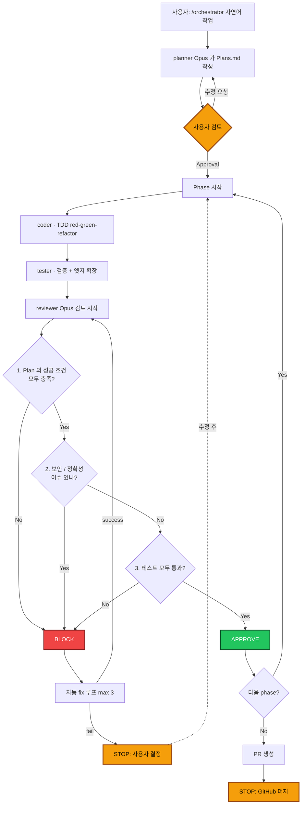

<div align="center">

# claude-code-harness

**Claude Code v2.1+ 용 워크플로우 하네스**

`/orchestrator` 한 번으로 계획 → 구현 → 리뷰 → PR 자동화

`6 subagent` · `6 verb skill` · `2 PreToolUse hook` · `phase runner`

[](https://code.claude.com)
[](LICENSE)

**한국어** · [English](README.en.md)

</div>

---

## What This Is

> Claude Code 가 기본 상태에서 흔히 보이는 두 문제 — **계획 없이 바로 코드부터 시작** + **위험 명령 무방비 실행** — 를 막는 절차 묶음.
>
> 프로젝트 루트에 `.claude/` 트리를 복사하면 활성화.

### Components

| 구성 | 위치 | 역할 |
|---|---|---|
| **Subagents** (6) | `.claude/agents/*.md` | 격리된 context 의 worker — `explorer` / `planner` / `coder` / `tester` / `reviewer` / `documenter` |
| **Verb skills** (6) | `.claude/skills/*/SKILL.md` | 슬래시 명령어 — `/orchestrator` 외 5개 옵션 |
| **PreToolUse hooks** (2) | `.claude/hooks/*.sh` | `block-destructive.sh`, `protect-secrets.sh` |
| **Phase runner** | `scripts/harness/run_phase.py` | 긴 phase 작업 분리 |
| **Doc templates** | `docs/harness/*.md` | `REQUIREMENTS` / `ADR` / `DOC_SYNC_POLICY` |

<details>
<summary><strong>각 컴포넌트 상세</strong></summary>

<br>

**Subagents**
각자 격리된 context window 에서 동작 → verbose 한 tool 출력은 하위 세션에 머물고 메인엔 요약만 반환. 의사결정 비싼 단계 (`planner`, `reviewer`) 만 Opus, 나머지는 Sonnet 으로 모델 비용 분리.

**Verb skills**
`/orchestrator` (메인) + `/plan`, `/work`, `/review`, `/release`, `/setup` (옵션). description 매칭으로 자연어 invocation 가능. `/release` 만 `disable-model-invocation: true` 로 잠가둠 — 커밋/푸시/PR 같은 side effect 가 있어서 사용자 직접 타이핑.

**PreToolUse hooks**
모델 prompt 에 의존하지 않고 stdin JSON → exit code 로 결정.

| Hook | matcher | 차단 대상 | 테스트 |
|---|---|---|---|
| `block-destructive.sh` | `Bash` | `rm -rf` 시스템 경로, `git push --force`, `git reset --hard origin/*`, `dd of=/dev/sd*` | 18 / 18, 오탐 0 |
| `protect-secrets.sh` | `Edit\|Write` | `.env*`, `*.pem`, `credentials*`, `.mcp.json` | 11 / 11 |

**Phase runner**
`claude --agent <name> -p` 래퍼. 긴 phase 작업을 별도 process 로 spawn → `.claude/notes/phase-N-<agent>-<ts>.log` 에 stdout 캡처. 메인 세션 컨텍스트 보호.

**Doc templates**
`REQUIREMENTS.template.md`, `ADR.template.md`, `DOC_SYNC_POLICY.md`.

</details>

---

## Why a Harness

Claude Code 는 강력하지만 기본 동작에 절제가 없다. 자연어 작업을 던지면 즉시 코드부터 치고, `rm -rf` 같은 위험 명령도 instruction 만으론 깜빡할 수 있다. 이 하네스는 그 위에 6개 강제력을 얹는다.

### 1. Plan 먼저
코드 수정 전에 `Plans.md` 가 있어야 한다. `planner` (Opus) 가 작업을 phase 단위로 분해하고 각 phase 의 acceptance criteria 를 적는다. Plan 이 부실하면 그 위에 쌓이는 모든 게 부실해지므로 Opus 토큰을 여기 투자한다.

각 phase 는 **vertical slice** 로 분해한다 — 한 phase 가 DB + service + API + UI 를 가로질러 **한 기능이 end-to-end 로 작동**하게.

예시 — "webhook 3개 (Slack/Discord/Telegram) 추가" 작업:

- ✅ **vertical**: Phase 1 = Slack webhook DB→서비스→API→UI 끝까지 / Phase 2 = Discord 끝까지 / Phase 3 = Telegram 끝까지. **각 phase 끝나면 한 기능이 진짜 동작**.
- ❌ **horizontal**: Phase 1 = 3개 webhook 의 DB 다 / Phase 2 = 서비스 다 / Phase 3 = API 다 / Phase 4 = UI 다. **마지막 phase 까지 가야 한 기능이라도 작동**.

horizontal 은 도중에 발견되는 문제 (DB 스키마가 UI 요구와 안 맞음 등) 를 마지막에야 발견하게 만들고, reviewer 가 phase 별로 검증할 거리도 빈약해진다 ("DB 만 추가됨 = valid" 정도). vertical 이 reviewer / 사람 양쪽에 더 쓸모 있는 단위.

> Claude Code 자체에도 [plan mode](https://code.claude.com/docs/en/permission-modes#analyze-before-you-edit-with-plan-mode) (read-only 탐색 + Plan agent) 가 있음. 본 하네스의 `/plan` 은 그 위에 phase 분해 + acceptance criteria + 영속화 (`Plans.md` 파일) 를 더한 것.

### 2. TDD red-green-refactor (default)
각 phase 안에서 `coder` 는 강제로 TDD 사이클을 따른다:

1. acceptance criteria 를 충족하는 **실패 테스트** 부터 작성
2. **red** 확인 (test runner 가 fail 출력)
3. **최소 구현** 으로 통과시킴
4. **green** 확인 (test runner 가 pass 출력)
5. (필요시) **refactor** — green 유지하면서

테스트가 implementation 을 lead 한다. 이 순서를 어기면 코드는 본인 가정에 맞춘 자기충족적 코드가 되고 회귀에 취약해진다. `tester` 는 이후 단계에서 acceptance 외 엣지 케이스 테스트를 추가로 채우고, 모든 테스트가 deterministic 한지 검증.

### 3. 한 phase 씩
한 phase = 한 reviewable 단위 — 보통 수백 줄 diff (경험상 300-500 줄 정도가 무리 없음) 안에서 끊는다. 작업 크기에 따라 phase 수는 달라지지만 보통 3-7개 정도, 각 phase 가 독립 머지 가능하도록 설계한다. 큰 diff 는 `reviewer` agent 도 사람도 놓치는 게 늘어난다 — context window 가 길어질수록 모델이 엣지 케이스나 회귀를 놓치는 빈도가 올라가고, 사람의 리뷰도 형식적이 된다. 작게 쪼갤수록 양쪽의 정확도가 모두 올라간다.

### 4. 4-lens review + 스택 룰
머지 전 `reviewer` (Opus) 가 4 관점 — spec / security / correctness / performance — 적용. 거기에 본인 스택의 함정을 추가: Django ORM N+1, Spring `@Transactional` on private method (proxy 우회), FastAPI `async def` 안의 sync DB 호출 (event loop 블록) 등.

### 5. Hook 으로 강제
instruction 은 모델이 깜빡할 수 있다. PreToolUse hook 이 셸 레벨에서 deny 한다. exit code 2 + JSON deny → Claude 에게 차단 사유가 표시됨. `--dangerously-skip-permissions` 모드에서도 hook 차단은 작동.

### 6. 사람 게이트 3개
다음 3개는 자동화 안 함:

1. Plan 승인
2. BLOCK verdict 시 결정
3. PR 머지

그 외엔 전부 자동.

---

> 비싼 부분 — phase 분해, TDD 사이클, 엣지 케이스 확장, 4관점 리뷰, 자동 fix 루프 — 은 AI 가 처리하고, 사람은 게이트 셋만 통과시킨다.


## Install

### 기존 프로젝트에 추가

```bash
cd ~/your-project

git clone https://github.com/jangheejeong/claude-code-harness.git .harness-tmp
cp -r .harness-tmp/.claude ./
cp -r .harness-tmp/scripts ./
cp -r .harness-tmp/docs ./
cp .harness-tmp/CLAUDE.md.example ./CLAUDE.md   # 본인 프로젝트에 맞게 수정
cp .harness-tmp/HARNESS.md ./
rm -rf .harness-tmp

chmod +x .claude/hooks/*.sh

cat > .claude/settings.json <<'JSON'
{
  "hooks": {
    "PreToolUse": [
      {
        "matcher": "Bash",
        "hooks": [{ "type": "command", "command": "\"$CLAUDE_PROJECT_DIR\"/.claude/hooks/block-destructive.sh" }]
      },
      {
        "matcher": "Edit|Write",
        "hooks": [{ "type": "command", "command": "\"$CLAUDE_PROJECT_DIR\"/.claude/hooks/protect-secrets.sh" }]
      }
    ]
  }
}
JSON
```

확인:

```text
> claude
> /agents              # 6 subagent 보여야 함
> /                    # 6 verb skill 보여야 함
```

### 멀티-프로젝트 워크스페이스

여러 독립 git repo 가 한 폴더 아래 모인 환경 (모노레포 X) 이라면, 그 폴더 루트에 `.claude/` 등을 떨어뜨리고 `CLAUDE.md` 의 프로젝트 지도를 본인 서브프로젝트로 채움. 거기서 `claude` 띄우면 모든 서브프로젝트에 하네스 적용.

---

## Usage

### Flow



> **Reviewer 의 3단계 판단**: 1번 (Plan 성공 조건) → 2번 (보안/정확성) → 3번 (테스트) 순서로 검사. 셋 다 통과해야 APPROVE, 하나라도 실패하면 BLOCK 후 자동 fix 루프 진입.

### 사용 방법

```bash
$ cd ~/your-project && claude

> /orchestrator api-server 의 webhook 에 HMAC 검증 추가
```

| Step | What happens |
|---|---|
| **1.** Plan | `planner` 가 phase 분해 + acceptance criteria 작성 → `Plans.md` 저장 |
| **⛔ Gate** | 사용자가 `Plans.md` 검토 + Approval ✓ |
| **2.** Loop | Phase 별 TDD 사이클 (`coder` red→green→refactor) → `tester` 검증/확장 → `reviewer` 4-lens. BLOCK 이면 자동 fix 루프 (최대 3회) |
| **3.** Release | `documenter` 가 README/CHANGELOG 갱신 → commit → push → `gh pr create` |
| **⛔ Gate** | 사용자가 GitHub 에서 PR 머지 |

> 사용자가 일상적으로 입력하는 verb 는 `/orchestrator` 하나로 충분하다. 나머지 5개는 특수 상황용.

### 사용자가 개입하는 3 지점

워크플로우 안에서 사람이 직접 결정해야 하는 지점은 셋이고, 그 외엔 모두 자동이다.

**Plan 승인.** `planner` 가 작성한 `Plans.md` 를 검토하고 Approval 박스에 체크해야 다음 단계로 넘어간다. Plan 이 부실하면 그 위에 쌓이는 코드, 테스트, 리뷰가 모두 부실해지므로 이 검토에 시간을 충분히 쓰는 게 작업 전체에서 가장 큰 레버리지다.

수정이 필요하면 `Plans.md` 를 직접 편집하기보단 자연어로 요청하는 게 좋다 — _"Phase 2 가 너무 크다, 둘로 쪼개줘"_, _"acceptance 가 모호하다, 구체적인 status code 로 바꿔"_, _"만료 nonce 처리 phase 가 빠졌다, 추가해"_ 식. `planner` 가 다시 짜고 사용자는 다시 검토. 직접 편집은 planner 가 본인이 안 쓴 변경을 모르게 만들어 이후 단계와 어긋난다.

**BLOCK verdict.** `reviewer` 가 BLOCK 을 내고 자동 fix 루프 (최대 3회) 가 풀지 못하면 흐름이 멈춘다.

3회 안에 풀리지 않는 BLOCK 은 보통 다음 셋 중 하나의 신호다:

- Plan 의 가정이 잘못됨
- 더 큰 architectural 결정이 필요함
- reviewer 의 finding 자체가 false positive

이때 **사용자가 직접 코드를 수정하는 건 권장하지 않는다.** 사람이 코드를 직접 만지는 순간 하네스의 컨텍스트와 어긋나기 시작하고, 이후 phase 의 reviewer / coder 가 사용자의 직접 변경을 모르는 상태로 진행하면서 회귀가 쌓인다. 자연어로 방향을 다시 잡아주는 게 올바른 대응이다:

- _"Phase 2 의 가정이 틀렸다, X 대신 Y 로 가자"_
- _"이건 false positive 다, reviewer 에게 다시 보라고 해"_
- 더 큰 방향 전환이면 `/plan` 으로 Plan 을 다시 짠 뒤 `/orchestrator` 재실행

자연어로도 안 풀리는 막힘이라면 그건 보통 Plan 의 근본 가정을 다시 봐야 할 시점이지, 사용자가 코드 패치로 우회할 문제가 아니다.

**PR 머지.** 머지는 GitHub 에서 사람이 직접 클릭한다. `main` 으로의 자동 머지는 의도적으로 비활성화 — 동료 리뷰와 CI 가 통과한 뒤 사람의 손이 한 번 들어가는 흐름을 강제한다.

---

## When to Use Other Verbs

`/orchestrator` 가 평소 흐름. 나머지 5 verb 는 특수 상황용.

| Verb | 언제 쓰나 |
|---|---|
| `/plan` | Plans.md 의 phase 분해를 **다시 짜고 싶을 때** (시공은 안 함) |
| `/work N` | Plans.md 가 있는 상태에서 **N 번째 phase 만 따로** (디버깅) |
| `/review` | 마지막 작업 diff **리뷰만 다시** |
| `/release` | 본인 commit/PR 스타일 따로 있어서 자동 PR 안 쓰고 싶을 때 — 사실 안 써도 됨. `disable-model-invocation: true` 로 잠가둠. <sup>[1]</sup> |
| `/setup` | **신규 서브프로젝트** 첫 부트스트랩 (한 번만) |

<sup>[1]</sup> Claude Code v2.1.74+ 에서 검증. 이전 버전은 슬래시 호출도 막힐 수 있음 ([issue #26251](https://github.com/anthropics/claude-code/issues/26251)). `claude --version` 으로 확인.

---

## When NOT to Use

다음 작업은 `/orchestrator` 거치지 말고 그냥 채팅:

```text
> apps/server.py 의 logger 레벨 INFO 로 바꿔줘
> 이 함수에 docstring 추가해줘
> README 오타 고쳐줘
```

| 상황 | 권장 |
|---|---|
| 한 파일 한두 줄 수정 | 그냥 채팅 |
| 빠른 디버깅 / 탐색 / 스파이크 | 그냥 채팅 |
| README / 문서 단순 수정 | 그냥 채팅 |
| 3 phase 이상 새 기능 / 리팩토링 | `/orchestrator` |
| 보안/정확성 중요한 변경 | `/orchestrator` |
| 멀티-프로젝트 인터페이스 변경 | repo 단위로 `/orchestrator` |

> 하네스는 3 phase 이상 본격 작업에서 본전. 그 외엔 우회.

---

## Side Commands

```text
> /compact
```
컨텍스트 정리. 작업 사이마다 권장.

```text
> @agent-explorer api-server 의 webhook 라우팅 보여줘
> @agent-reviewer 이 PR 다시 봐줘
```
특정 agent 직접 호출 — `@` 입력하면 typeahead.

```text
> 이번엔 하네스 빼고 그냥 고쳐줘
```
일시적 우회.

---

## Cheatsheet

```text
1. cd ~/your-project && claude
2. > /orchestrator <자연어 작업 설명>
3. ⛔ Plans.md 검토 + Approval ✓
4. (자동 진행)
5. ⛔ BLOCK 났으면 자연어로 방향 재지시 → /orchestrator 재실행
6. ⛔ GitHub 에서 PR 머지
7. 다음 작업 → /orchestrator <다음 작업>
```

> 외울 verb: `/orchestrator` 1개.

---

## Project Structure

```text
.
├── CLAUDE.md.example              # 작업 규칙 + 프로젝트 지도 (CLAUDE.md 로 복사)
├── HARNESS.md                     # 종합 사용 가이드
│
├── .claude/
│   ├── agents/                    # 6 subagent
│   │   ├── explorer.md            #   read-only · 코드 탐색
│   │   ├── planner.md             #   Opus · phase 분해
│   │   ├── coder.md               #   1 phase TDD 구현 (red-green-refactor)
│   │   ├── tester.md              #   TDD 검증 + 엣지 케이스 확장
│   │   ├── reviewer.md            #   Opus · 4 lens + 스택 룰
│   │   └── documenter.md          #   문서 동기화
│   ├── skills/                    # 6 verb skill
│   │   ├── orchestrator/          #   /orchestrator (메인)
│   │   ├── plan/                  #   /plan
│   │   ├── work/                  #   /work N
│   │   ├── review/                #   /review
│   │   ├── release/               #   /release (locked)
│   │   └── setup/                 #   /setup
│   └── hooks/
│       ├── block-destructive.sh   # 위험 셸 명령 차단
│       └── protect-secrets.sh     # 시크릿 파일 쓰기 거부
│
├── scripts/harness/
│   └── run_phase.py               # /orchestrator 가 호출, 긴 phase 출력 분리
│
├── docs/harness/
│   ├── REQUIREMENTS.template.md   # /setup 이 복사, planner 가 읽음
│   ├── ADR.template.md            # documenter 가 결정 기록 시 사용
│   └── DOC_SYNC_POLICY.md         # documenter 가 문서 갱신 판단 시 참고
│
└── examples/
    ├── reviewer-python.md         # Python (Django/FastAPI/Airflow)
    └── reviewer-java-spring.md    # Java (Spring/JPA/WebFlux)
```

> **빌트인과의 이름**: Claude Code 빌트인 subagent (`Explore`, `Plan`, `general-purpose`) 와 본 하네스 커스텀 (`explorer`, `planner`) 은 대소문자가 달라 충돌 안 함. 빌트인은 read-only quick-research 용, 본 커스텀은 Plans.md 연동 워크플로우 전용.

자세한 사용법 / 트러블슈팅 / 비용 가이드는 [HARNESS.md](HARNESS.md) 참고.

---

## Reviewer — Stack-Agnostic by Default

`reviewer` (Opus) 가 PR 직전 4 lens 적용. **Universal lens 는 항상 포함**, **stack-specific 룰은 placeholder 로 비워둠** — 본인 스택에 맞게 채우는 게 다음 섹션.

| Lens | Universal checks |
|---|---|
| **Spec** | Plan 에 적힌 성공 조건이 실제 코드에서 충족됐는지 |
| **Security** | 시크릿 노출, 인젝션 (SQL/명령/템플릿), SSRF, path traversal, AuthZ, PII 로깅 |
| **Correctness** | 엣지 케이스, 에러 처리, 네이밍, dead code, 테스트 커버리지 |
| **Performance** | 메모리 폭주, async 경로의 blocking I/O, 관측성 결함 |

### Verdict tags

| Tag | 의미 |
|---|---|
| `[BLOCK]` | 보안 / correctness / spec 미달. 머지 차단. |
| `[CHANGES]` | 머지 전 수정 권장. |
| `[NIT]` | 선택적 개선. |
| `[EXISTING]` | 기존 코드 이슈. 이번 PR 차단 안 함, 별도 티켓 권장. |

---

## Safety Hooks — What They Block

PreToolUse hooks. stdin JSON 으로 tool input 수신 → exit code `0` (allow) / `2` (deny + reason) 로 결정. `.claude/settings.local.json` 의 `hooks.PreToolUse` 에 wired.

> **권한 모드 우회 불가**: hook 의 `deny` 는 사용자가 `--dangerously-skip-permissions` 또는 `bypassPermissions` 모드로 띄워도 작동. 즉 사용자가 권한 검사 끄고 띄워도 hook 차단은 그대로. 팀 정책 / 보안 가드용으로 신뢰 가능.

### `block-destructive.sh` · matcher: `Bash`

```text
deny:  rm -rf {/, ~, $HOME, /usr/*, /etc/*, /Library/*, ...}
deny:  git push {--force, --force-with-lease, -f}
deny:  git reset --hard origin/<branch>
deny:  dd of=/dev/{sd,nvme,hd,disk}*

allow: rm -rf {node_modules, /tmp/foo, .venv, build}
allow: git push -u origin <branch>
allow: git reset --hard HEAD~1
```

> 18 / 18 케이스 통과, 오탐 0.

### `protect-secrets.sh` · matcher: `Edit|Write`

```text
deny:  .env*, *.pem, *.key, *.p12, *credentials*.{json,yaml}, *token*.{json,yaml}, .mcp.json
allow: README.md, main.py, credentials.md, *.txt   (문서 파일은 OK)
```

> 11 / 11 케이스 통과.

---

## Honest Limitations

- **결과의 상한은 Plan 의 품질이 정한다.** Plan 이 모호하면 코드도 리뷰도 모호해진다. `planner` 에 Opus 를 할당하는 게 작업 전체에서 가장 가성비 좋은 결정이다.
- **`/orchestrator` 한 번은 phase 수만큼의 subagent 호출 (`planner` + `coder` + `tester` + `reviewer` × phase 수) 을 포함하므로 단일 채팅보다 토큰 소비가 많다.** 정확한 배수는 코드베이스 크기, phase 분해 깊이, BLOCK 자동 fix 루프 횟수에 따라 크게 달라지므로 본인 환경에서 직접 측정하는 게 맞다.
- **단일 세션 subagent 패턴을 따른다.** Claude Code 의 [Agent Teams](https://code.claude.com/docs/en/agent-teams) — teammates 끼리 직접 메시지를 주고받고 공유 task list 를 다루는 패턴 — 는 의도적으로 채택하지 않았다. 일반적인 phase 단위 작업에는 단일 세션 + 격리 컨텍스트가 더 단순하고 디버깅하기 쉽다. 10명 이상의 worker 가 자율 토론하며 동시에 작업하는 시나리오라면 Agent Teams 쪽이 토큰 효율도 3-5배 좋다.

---

## Customize for Your Stack

> 의도적으로 **언어/프레임워크 비종속** 으로 출발. 본인 스택에 맞춰 다음 표대로 채움.

### What to edit, where

| 커스터마이즈 대상 | 수정할 파일 | How |
|---|---|---|
| **스택별 reviewer 룰** (ORM N+1, async/sync 혼합, 마이그레이션 안전성, 프레임워크 함정) | `.claude/agents/reviewer.md` 의 "Stack-specific" 서브섹션 | `examples/reviewer-python.md` / `examples/reviewer-java-spring.md` 참고하여 작성 |
| **의존성 매니저 / 린트 / 테스트 러너** | `.claude/agents/coder.md`, `tester.md` | agent 가 `pyproject.toml`/`package.json`/`pom.xml` 등 lock file 을 읽고 따라가도록 instruction 작성됨. 특정 도구를 강제하려면 한 줄 추가 |
| **빌드 산출물 skip 폴더** | `.claude/agents/explorer.md` | 표준 폴더 (`node_modules`, `.venv`, `target`, `build`, `dist`) 이미 포함 |
| **테스트 디렉토리** | `.claude/agents/tester.md` | agent 가 `tests/`, `src/test/java/`, `__tests__/` 등 표준 위치를 인식하도록 instruction 작성됨. 비표준 위치면 한 줄 추가 |
| **프로젝트 지도 / 작업 규칙** | `CLAUDE.md` | `CLAUDE.md.example` 복사 후 채움. **Anthropic 권장 200 줄 / 150 instruction 이내**. 그 이상은 `@import` 로 분리 |
| **요구사항 / 인수 기준** | `<subproject>/REQUIREMENTS.md` | `docs/harness/REQUIREMENTS.template.md` 복사 후 채움 (또는 `/setup` 자동화) |

### Reference reviewers

| 스택 | 파일 |
|---|---|
| Python (Django / FastAPI / Airflow) | [`examples/reviewer-python.md`](examples/reviewer-python.md) |
| Java (Spring Boot / JPA / WebFlux) | [`examples/reviewer-java-spring.md`](examples/reviewer-java-spring.md) |
| Kotlin / Scala / Go / Rust / Ruby / ... | _PR 환영_ |

복사 명령:

```bash
cp examples/reviewer-<your-stack>.md .claude/agents/reviewer.md
```

### Advanced — Subagent persistent memory

특정 agent 가 **cross-session 으로 학습**하길 원하면 frontmatter 에 `memory: project` 추가:

```yaml
---
name: reviewer
memory: project
...
---
```

→ `.claude/agent-memory/reviewer/MEMORY.md` 에 자주 발견되는 이슈 / 코드베이스 특화 패턴이 누적된다. 다음 세션에서 reviewer 가 그 메모리를 참고. 같은 옵션을 다른 agent 에도 적용 가능.

---

## License

[MIT](LICENSE)

---

## Contributing & Acknowledgments

- 워크플로우 구조: 민세홍님의 6-agent 디자인에서 시작.
- Best-practice 참고: [Chachamaru127/claude-code-harness](https://github.com/Chachamaru127/claude-code-harness), [Anthropic Claude Code 공식 문서](https://code.claude.com/docs), [Martin Fowler — Harness engineering](https://martinfowler.com/articles/harness-engineering.html).
- Spec-Driven Development 패밀리 (본 하네스보다 무겁지만 같은 계보): [gotalab/cc-sdd](https://github.com/gotalab/cc-sdd), Superpowers, GSD.
- 새 스택 reviewer 추가 PR 환영.
